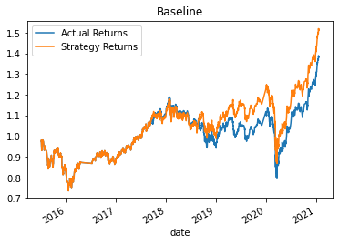
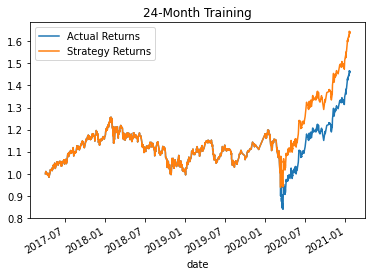
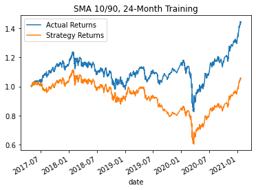
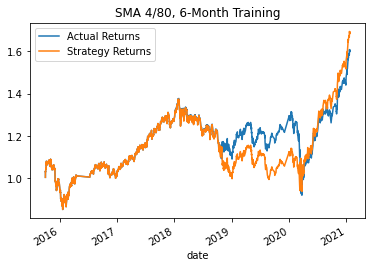
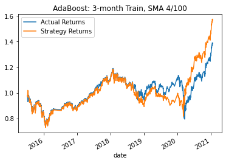

# Algorithmic-Trading-ML
Establish a baseline trading bot, enhance the existing trading signals with machine learning algorithms.

---
## Technologies

Python modules used:

* pandas
* numpy
* pathlib
* hvplot.pandas
* matplotlib.pyplot
* sklearn svm
* sklearn metrics
* sklearn.ensemble AdaBoostClassifier
* sklearn.preprocessing StandardScaler
* sklearn.metrics classification_report
---
## In a Jupyter Notebook:
* Establish a Baseline Performance
* Tune the Baseline Trading Algorithm
* Evaluate a New Machine Learning Classifier

---
## Summary
### <ins>Baseline model with the SVM classifier, and several tuning attempts</ins>:

An emerging markets dataset spanned 2015-04-02 to 2017-01-22. 
Baseline model split the first 3 months for training, and the remainder for testing. SMA fast/slow windows were 4/100 days, and the SVM classifier was used for the baseline and three variations.

Since the train/test split moves the goal-posts for the cumulative return calculation, models are evaluated on a Model_Return =  (Strategy / Actual) basis.

<pre>
Cumulative Return (2021-01-22)
    SVM Classifier
      Actual    Strategy   Return   Model     Train     SMA
    1.386976	1.517607    9%    Baseline: 3 months    4/100
    1.464098	1.642728   12%    Tune_1:   24 months   4/100
    1.442623	1.056894   -7%    Tune_2:   24 months   10/90
    1.606148	1.691820    5%    Tune_3:   12 months   4/80

    AdaBoost Classifier
      Actual  Strategy
    1.386976	1.570820   14%    Baseline:   3 months train, SMA 4/100
</pre>

---

<table><tr>
<td>  </td>
<td>  </td>
</tr></table>
<table><tr>
<td>  </td>
<td>  </td>
</tr></table>

---

Between Baseline and Tune 1, the classification report showed an accuracy improvment from .71 to .72, and the model return increased from 9% to 12%, so increasing the training window was worthwhile.

Tune 2 proved not worthwhile, with the classification report showing accuracy dropped to .54 and the model return was sharply down into negative territory.

Tune 3 accuracy recovered to .56, and model return was positive, but Tune 1 remains the winner.

---

### <ins>Baseline model paremeters, with the AdaBoost classifier</ins>:

As the above table shows, model return with the AdaBoost classifier was 14%, outperforming both the Baseline return (9%) and Tune 1 return (12%) that were achieved with the SVM classifier. 

For future development I would try tuning model parameters using the AdaBoost classifier.

---
## Contributors

[David Jonathan](https://www.linkedin.com/in/david-jonathan-1b9470/)

---

## License

Licensed under the [MIT License](https://github.com/tmbo/questionary/blob/master/LICENSE). Copyright 2021 David Jonathan
